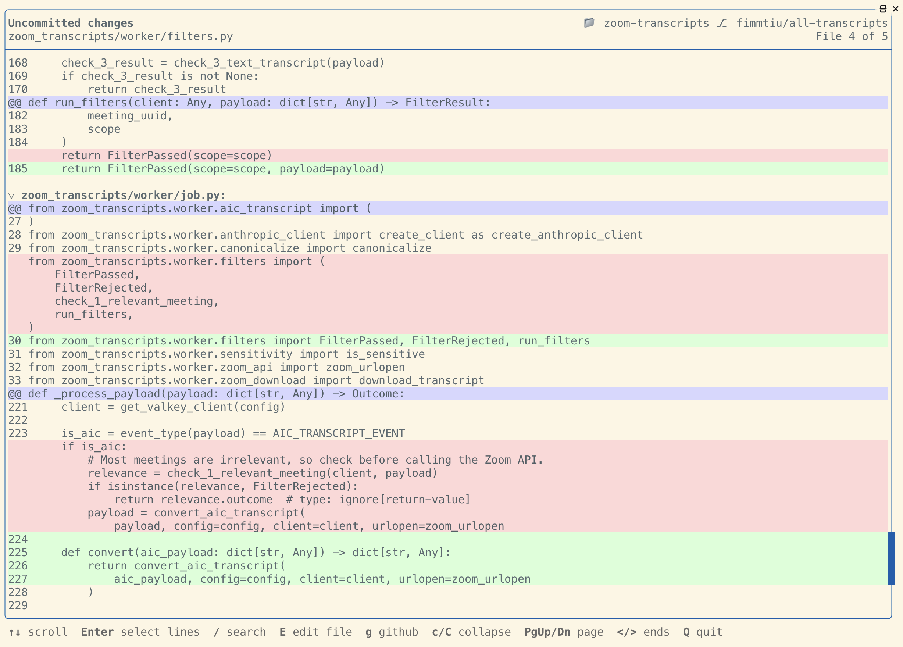

# git-view

A full-screen terminal viewer for git commits and diffs, intended to make reading code changes and browsing commit
history from a terminal a pleasant experience.



## Install

```
go build -o git-view .
```

## Usage

```
git-view
```

Run it inside a git repository. It takes no arguments.

## Commit selector

The app opens on the commit selector. The left pane lists the most recent 100 commits on the current branch, newest
first, and the right pane shows `git show --stat` for whichever one the cursor is on.

- Uncommitted changes appear at the top as `???? Uncommitted changes`. This covers modified tracked files and untracked
  ones, which show as new files. Ignored files and staged changes are left out.
- A horizontal rule marks where the current branch diverged from `main` or `master`, separating your commits from the
  ones you branched off.
- Merge commits are omitted. Nobody likes you, merge commits. Go away.

Move the cursor to pick a single commit, or hold `Shift` while moving to select a range of commits. Press `Tab` or
`Enter` to read the diff for that selection.

## Diff viewer

`Tab` or `Escape` returns to the commit selector, with your selection intact.

Press `Enter` to enter line-select mode, which puts a cursor on an individual line of the diff so that `E` and `g` can
target it. `Escape` leaves line-select mode; `Tab` still returns to the selector.

## Search

Press `/` in the diff viewer. The help line at the bottom becomes a search box where you can type a term and press
`Enter`, just like `less`. Every occurrence lights up, and the viewer jumps to the first match. Press `Escape` to exit
search mode.

The term is matched exactly, so case counts. Only the text of the changed files is searched: the `@@` hunk headers, the
file names, and the line-number gutter are part of the viewer rather than the files, and never match.

## Keys

| Key | Commit selector | Diff viewer |
|-----|-----------------|-------------|
| `↑` `↓` / `j` `k` | Move the cursor | Scroll, or move the line cursor |
| `Shift`+`↑` `↓` | Extend the selection | — |
| `PgUp` `PgDn` / `b` `Space` | Page up and down | Page up and down |
| `<` `>` / `Home` `End` | Jump to the ends | Jump to the ends |
| `Tab` / `Enter` | View the selected diff | `Tab` returns to the selector |
| `Enter` | — | Enter line-select mode |
| `/` | — | Search the diff |
| `Esc` | — | Leave the search, line-select mode, or the viewer |
| `c` / `C` | — | Collapse or expand one file / every file |
| `E` | Open the repository in your editor | Open the current file, at the selected line |
| `g` | — | Open the current file on GitHub |
| `q` / `Ctrl-C` | Quit | Quit |

Outside line-select mode, "the current file" is the one at the top of the pane,
and `E` and `g` open it without a line number.

## Editor

`E` uses the first of `$GIT_VIEW_EDITOR`, `$VISUAL`, or `$EDITOR` that is set,
falling back to the first of `cursor`, `code`, or `zed` found on `PATH`.
Line-number syntax is handled per editor (`--goto file:line` for VS Code-family
editors, `+line file` for the vi family). GUI editors are launched in the
background; terminal editors take over the screen and return to the viewer when
they exit.

## GitHub

`g` opens `https://github.com/<owner>/<repo>/blob/<ref>/<path>` via the `open`
command, appending `#L<line>` when a line is selected. The ref is the current
branch, or the HEAD commit hash when the working tree is on a detached HEAD.
